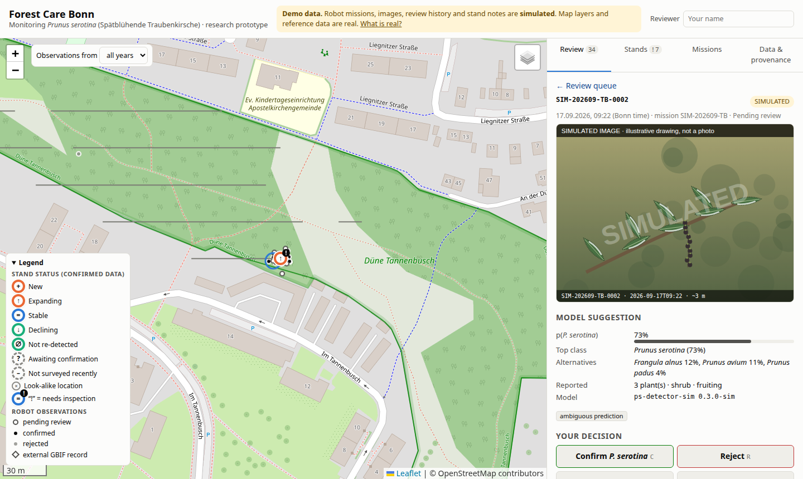

# Forest Care Bonn

A working prototype for robot-assisted monitoring of one invasive plant in Bonn:
***Prunus serotina*** (Spätblühende Traubenkirsche). LANUK NRW classifies it as invasive
because it forms dense shrub layers that suppress the regeneration of oak, rowan and pine.

A ground robot surveys forest and wooded park land and reports candidate detections
through a ROS 2 gateway. People can add folders of geotagged field photos. Each detection or photo is placed in
real Bonn and NRW context: district, land use, nature reserves, FFH sites, protected
biotopes, and GBIF and LANUK records. An expert confirms or rejects it.
Repeated surveys then show where stands **appear, expand, stay stable, decline, or need
inspection**. The system never recommends removal; ecological decisions stay with people.



## Quick start

Requires Python ≥ 3.11 and [uv](https://docs.astral.sh/uv/).

```bash
uv sync                               # install dependencies into .venv
uv run python -m forestcare seed      # build the demo database (simulated robot missions + a synthetic photo walk)
uv run python -m forestcare serve     # open http://127.0.0.1:8000
```

The API is documented at http://127.0.0.1:8000/docs, including the robot ingest contract
(`POST /api/missions`).

## A five-minute tour

1. **Review tab.** 40 items from September 2026 wait for a decision: 34 robot detections
   and 6 field photos. Enter your name at the top right, open an item, and look at the (simulated)
   camera frame: glossy, serrated leaves and fruit in racemes point to *P. serotina*;
   fruit in the leaf axils points to *Frangula*. Decide with the buttons or the keys
   C / R / U / F. The next item opens automatically.
2. **Why is it in the queue?** Each item lists its reasons, for example "Detected after
   management recorded on 2026-02-12 (possible resprouting)", "In or near NSG Kottenforst"
   or "Known look-alike location: 12 earlier detection(s) rejected (*Prunus padus* ×12)".
3. **Stands tab.** Filter by status. Open **Expanding**: a stand inside NSG Düne
   Tannenbusch that grew from 4 to 16 confirmed plants over three years. Its page shows
   the survey history, the reasons to look again, and which of LANUK's published
   priority situations apply ("not a recommendation"). The stand log holds human
   entries only.
4. **Try this.** Confirm the pending seedlings of the unverified stand in NSG Ennert. It
   turns into a **New** stand in a protected area.
5. **Field photos.** Open a queue item marked "Field photo". There is no model output.
   Instead you see the original file (download, SHA-256), camera, capture time and
   position accuracy, each with its source, and all EXIF tags. Confirm it, optionally
   with a plant count, height and phenology. Without a count a photo proves presence,
   and it is never used for trends.
6. **Missions tab.** Every survey with its driven track, and the photo mission. In 2026 the Kottenforst missions
   skipped a blocked transect, so the stand behind it is **Not surveyed recently** instead
   of being counted as gone. **Import field photos** takes a folder of your own
   geotagged photos. The table at the bottom shows how reviewers judged detections at
   each model probability.
7. **Data & provenance tab.** Which data is real and which is simulated, licences,
   retrieval dates, hashes, an integrity check of all stored originals, and the audit log.
8. **Exports.** Stands as GeoJSON, and a CSV draft that uses the field names and value
   classes of LANUK's Neobiota reporting layer, with ETRS89/UTM32 coordinates.

## Importing field photos

A folder of geotagged photos (JPEG, TIFF or PNG with GPS in the EXIF) becomes one mission:

```bash
uv run python -m forestcare import-photos ~/Pictures/kottenforst-2026-09-20 \
    --photographer "Name" --area-name "Kottenforst walk"
uv run python -m forestcare verify-originals    # re-hash every stored original
```

The same import is available in the browser (Missions → Import field photos, folder
picker) and as `POST /api/photo-missions`. For each photo:

- **Original.** Stored byte-for-byte under
  `data/runtime/images/<mission>/originals/`, with a `MANIFEST.json`. The SHA-256 is
  recorded and re-checked on every download.
- **Metadata.** The complete EXIF is kept in the database. Each derived value (position,
  accuracy, capture time, heading) records which EXIF field it came from. Missing
  accuracy or time zone is flagged, never invented.
- **Preview.** A downscaled preview without metadata is shown in the review UI.
- **Duplicates.** A photo is identified by its content, so importing a folder twice
  adds nothing.
- **Not imported.** Photos without GPS, outside Bonn, or in HEIC format are listed with
  the reason.

Photo missions are **presence-only**. Photos show where someone found something. They
never count as survey coverage, so they cannot make a stand "not re-detected".

`uv run python -m forestcare make-sample-photos FOLDER` writes synthetic test photos.
They are marked in their EXIF, and the importer always stores them as simulated.

## Robotics: ROS 2 gateway, field rover, localization

The rover side lives in [`ros2/`](ros2/README.md) and never touches the web service
directly: it produces missions in the same contract (`POST /api/missions`).

- **Gateway** ([docs/ROS2_GATEWAY.md](docs/ROS2_GATEWAY.md)): live topics or a recorded
  rosbag2 → mission package (track, frames, GNSS accuracy, pose, operator marks, optional
  detections) → offline outbox → resumable upload.
- **Field data collection** ([docs/FIELD_DATA_COLLECTION.md](docs/FIELD_DATA_COLLECTION.md)):
  a teleoperated rover records synchronized camera, GNSS, IMU, odometry and LiDAR; the
  operator marks plants with a gamepad button.
- **Localization validation** ([docs/LOCALIZATION_VALIDATION.md](docs/LOCALIZATION_VALIDATION.md)):
  drive a route five times and find out whether the rover places the same plant close
  enough to recognise its stand again. In simulation, GNSS alone re-finds stands but merges
  stands closer than ~27 m; RTK + wheel odometry + IMU keeps stands 20 m apart separate.
  The dashboard shows each observation's calibrated uncertainty and the test behind it.

```bash
uv run python -m forestcare_gateway demo-bag /tmp/demo_bag             # a simulated mission as a real rosbag2
uv run python -m forestcare_gateway convert /tmp/demo_bag --outbox /tmp/outbox
uv run python -m forestcare_gateway upload --outbox /tmp/outbox --api http://127.0.0.1:8000
uv run python -m forestcare_gateway loc-experiment --out /tmp/locexp   # the localization experiment, simulated
```

No physical rover has driven yet: all rover data so far comes from the gateway's
simulator and is labelled `simulated` end to end.

## What is real, what is simulated

| Real                                                                             | Simulated                                                                  |
| -------------------------------------------------------------------------------- | -------------------------------------------------------------------------- |
| Bonn districts and wooded land use (Stadt Bonn, CC0)                             | Robot missions, tracks, detections                                         |
| NSG, FFH, protected biotopes (LANUK @LINFOS, dl-de/zero-2-0)                     | Camera images (labelled drawings, not photos)                              |
| GBIF records of*P. serotina* in Bonn (16)                                      | Classifier scores and GNSS error                                           |
| LANUK Neobiota find points (0 in Bonn, 5 in NRW) and species facts               | Plant positions and stand dynamics                                         |
| Orthophotos (Geobasis NRW) and forest layers (Wald und Holz NRW), live           | Review history before Sept 2026, two stand log entries                     |
| Photos you import (stored as`field_photos`)                                    | The demo photo walk (synthetic drawings, stored as`simulated`)           |
| ROS 2 tooling: rosbag2 files, live nodes, teleoperation (tested on ROS 2 Kilted) | Rover sensor data and the localization results, until the first field test |

Simulated plants were placed in real Bonn woodland so the context lookups are exercised.
**They say nothing about where the species actually grows.** Every simulated record
carries `source_kind = simulated` and a yellow badge in the UI.

## Documentation

- [docs/ARCHITECTURE.md](docs/ARCHITECTURE.md): design choices, components, workflow,
  status logic, data model, provenance, robot contract
- [docs/DATA_SOURCES.md](docs/DATA_SOURCES.md): the Bonn and NRW sources explored, used
  and not used, and the gaps found
- [docs/ASSUMPTIONS_AND_VALIDATION.md](docs/ASSUMPTIONS_AND_VALIDATION.md): what works
  (with tests), what is simulated, and the questions for local forest and ecology experts
- [docs/ROS2_GATEWAY.md](docs/ROS2_GATEWAY.md): ROS 2 topics, message flow, configuration,
  how images and positions are associated, contract 1.1
- [docs/FIELD_DATA_COLLECTION.md](docs/FIELD_DATA_COLLECTION.md): sensor setup, recording,
  teleoperation, field-test checklist
- [docs/LOCALIZATION_VALIDATION.md](docs/LOCALIZATION_VALIDATION.md): the repeated-run
  experiment, metrics, simulated results, and the recommended localization stack
- [ros2/README.md](ros2/README.md): guide to the two ROS 2 packages for robotics students

## Tests

```bash
uv run pytest              # 139 tests, including 5 browser tests and 2 live ROS 2 tests
uv run pytest -m "not browser and not ros"
```

The browser tests need the Playwright Chromium build (`uv run playwright install chromium`).
The ROS 2 tests need `/opt/ros/kilted` and build `ros2/` with colcon; without ROS they are
skipped.

## Project layout

```
forestcare/         core service: ingest, photo import, reference context, stands, review, export, API
simulator/          simulated world, robot missions, images, synthetic test photos, demo reviewer
web/                map + review UI (plain JS, Leaflet vendored)
data/reference/     real reference snapshots + manifest.json (committed)
data/runtime/       SQLite database, images, photo originals, generated payloads (not committed)
scripts/            fetch_reference_data.py: refresh the real snapshots
tests/              pytest suite
ros2/               ROS 2 packages: forestcare_gateway (rover data -> missions), forestcare_rover (teleoperated rover)
docs/               architecture, data sources, assumptions, ROS 2 gateway, field rover, localization
```

## Refreshing the reference data

```bash
uv run python scripts/fetch_reference_data.py
```

This downloads the current data from Offene Daten Bonn, the LANUK WFS and Neobiota
service, and GBIF, and rewrites `data/reference/*` and the manifest.

## Data attribution

Stadt Bonn (CC0) · LANUK NRW (dl-de/zero-2-0) · Geobasis NRW (dl-de/zero-2-0) ·
Landesbetrieb Wald und Holz NRW · GBIF.org occurrence data (per-record licences: CC0,
CC BY 4.0, CC BY-NC 4.0) · © OpenStreetMap contributors (basemap) · Leaflet (BSD-2-Clause).
