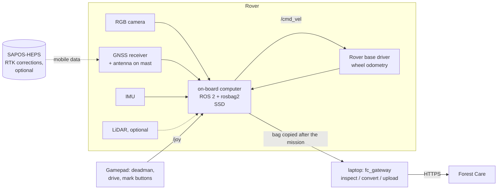

# Field data collection with a teleoperated rover

Milestone 2 turns the rover into a reliable observation platform. An operator drives it by
gamepad along a short survey route through a forest or park. The rover records everything
it senses, in sync, and the operator presses a button whenever something is worth a look.
The complete raw data stays in a rosbag, so perception and localization can be developed
offline later. The same bag becomes a Forest Care mission through the
[gateway](ROS2_GATEWAY.md).

Out of scope, on purpose: autonomous driving, real-time plant classification, and any plant
removal. The rover observes; people decide.

**First real-world goal:**

1. Drive a short route manually.
2. Record synchronized sensor data.
3. Convert the bag with the gateway.
4. See the real driven track and the operator's observations in the dashboard.

## The simplest setup



One computer on the rover runs the drivers, teleoperation and the recorder. Everything else
(conversion, upload, review) happens afterwards and needs no ROS.

## Recommended sensor setup

Example models are *classes of hardware* commonly used with ROS 2, not endorsements. None of
them was tested for this document; the rover-specific choices are marked as such below.

| Sensor | Recommendation | Why | Mounting | Rate | Topic |
|---|---|---|---|---|---|
| **GNSS** | Multi-band, RTK-capable receiver (u-blox ZED-F9P class) with a survey or helical antenna on a ground plane | Multi-band copes better with forest multipath. RTK corrections from [SAPOS-HEPS](https://www.bezreg-koeln.nrw.de/geobasis-nrw/produkte-und-dienste/raumbezug/satellitenpositionierungsdienst-sapos/sapos-heps) are free in NRW after registering with Bezirksregierung Köln (Geobasis NRW), via NTRIP over mobile data. | Highest point of the rover, on a mast (~1–1.5 m), clear of the camera and LiDAR | 5–10 Hz | `/gnss/fix` (+ `/gnss/time_reference`) |
| **IMU** | 9-DoF IMU (BNO08x/BNO055 class) or the rover's internal IMU | Heading and tilt, gyro for the fusion methods | Rigidly near the rover centre, axes aligned with `base_link` | 100 Hz | `/imu/data` |
| **Wheel odometry** | From the rover's motor controller (encoders) | Short-term motion between GNSS fixes; standstill detection | – | 20–50 Hz | `/odom` |
| **RGB camera** | USB3 camera, 1280×720 or more at 10 fps, recorded as JPEG (`image_transport` compressed). Global shutter or fast rolling shutter. | The image of every observation; offline perception training data | ~0.8–1 m high, looking ahead, pitched 10–20° down, lens hood | 10 fps | `/camera/image_raw/compressed`, `/camera/camera_info` |
| **LiDAR** (optional) | 3D (Livox Mid-360 / Ouster OS0 class) is best in forest: trunks for LiDAR odometry. 2D (RPLIDAR class) is enough for obstacle awareness. | LiDAR odometry for [localization](LOCALIZATION_VALIDATION.md); structure data for later | Above the base, unobstructed | 10 Hz | `/points` or `/scan` |
| **Computer** | Jetson Orin / Intel NUC / Raspberry Pi 5 (8 GB) class; NVMe SSD ≥ 256 GB; Ubuntu 24.04 + ROS 2 Jazzy (LTS) or Kilted | Enough for drivers + recording; no on-board perception needed yet | Shock-mounted, ventilated, rain cover | – | – |
| **Operator** | Wireless gamepad with a deadman button; physical e-stop on the rover | Safe teleoperation | – | – | `/joy`, `/cmd_vel` |

**Storage budget per hour:**

- 720p JPEG camera at 10 fps: about 4–6 GB.
- 3D LiDAR: about 10–20 GB more.
- 2D LiDAR, IMU, odometry and GNSS together: well under 1 GB.

`record_mission.sh` refuses to start with less than 20 GB free (override with `--force`).

## ROS 2 topics

The standard names below are what the gateway, the recorder, the pre-drive check and the
simulator all use. Each driver's output is remapped to them in `config/drivers.yaml`.

| Topic | Type | From | Recorded |
|---|---|---|---|
| `/gnss/fix` | `sensor_msgs/NavSatFix` | GNSS driver | yes |
| `/gnss/time_reference` | `sensor_msgs/TimeReference` | GNSS driver (if provided) | yes |
| `/gnss_rtk/fix` | `sensor_msgs/NavSatFix` | second (RTK) receiver, if any | yes |
| `/rtcm` | RTCM corrections | NTRIP client | yes |
| `/odom` | `nav_msgs/Odometry` | rover base driver (wheel odometry) | yes |
| `/odom_lidar` | `nav_msgs/Odometry` | LiDAR/visual odometry, if run live (usually offline) | yes |
| `/imu/data`, `/imu/mag` | `sensor_msgs/Imu`, `MagneticField` | IMU driver | yes |
| `/camera/image_raw/compressed`, `/camera/camera_info` | `CompressedImage`, `CameraInfo` | camera driver | yes (JPEG, not raw) |
| `/scan` or `/points` | `LaserScan` / `PointCloud2` | LiDAR driver | yes |
| `/tf`, `/tf_static` | `tf2_msgs/TFMessage` | base driver, `mounts.yaml` | yes |
| `/joy`, `/cmd_vel` | `sensor_msgs/Joy`, `geometry_msgs/Twist` | gamepad, `teleop_twist_joy` | yes (what the operator did) |
| `/forestcare/mark` | `std_msgs/String` | `mark` node (gamepad buttons) or `mark_console` | yes |
| `/diagnostics`, `/rosout` | | all nodes | yes |

The full list is `ros2/forestcare_rover/config/record_topics.txt`. Topics a rover doesn't
have are simply absent from the bag.

## Timestamps and synchronization

Everything later depends on the sensors sharing one clock:

- matching a frame to a GNSS fix;
- comparing runs;
- fusing odometry.

- **One clock.** All drivers stamp `header.stamp` with the computer's system clock at capture
  time. Keep that clock right with `chrony`. Ideally discipline it with the GNSS receiver's
  PPS output; otherwise sync over NTP before leaving the office (a Raspberry Pi has no
  battery-backed clock).
- **Check it, don't assume it.** The pre-drive check (`preflight`) and `fc_gateway inspect`
  report, per topic, the offset between header stamp and arrival time. They fail stamps that
  are not wall-clock time. A camera whose stamps are, say, 80 ms late gets
  `camera.time_offset_s: -0.08` in the gateway configuration.
- **Sensor positions.** `config/mounts.yaml` publishes where each sensor sits (static
  transforms, recorded in every bag). Offline algorithms need them, and the camera projection
  uses the antenna-to-camera geometry.
- **Rates.** GNSS 5–10 Hz, IMU 100 Hz, odometry 20–50 Hz, camera 10 fps and LiDAR 10 Hz
  are enough for observation and offline localization. No hardware triggering is needed at
  walking speed.

## Build and configure (once per rover)

```bash
sudo apt install ros-jazzy-desktop ros-jazzy-rosbag2-storage-mcap \
     ros-jazzy-teleop-twist-joy ros-jazzy-joy ros-jazzy-teleop-twist-keyboard
# plus the drivers for your sensors, e.g. ros-jazzy-usb-cam, ublox, ntrip_client, ...
cd forest-care/ros2 && colcon build --symlink-install && source install/setup.bash
```

Then edit the four rover-specific files in `ros2/forestcare_rover/config/`:

- **`drivers.yaml`:** which driver nodes to start, with remappings to the standard topics
  (templates included).
- **`mounts.yaml`:** measured sensor positions.
- **`teleop_joy.yaml`:** gamepad axes/buttons, deadman, speed limit (0.5 m/s), mark buttons.
- **`forestcare_gateway.yaml`:** robot id, camera and GNSS names, camera offset, Forest Care
  server URL.

## Recording procedure

```bash
# terminal 1: drivers, mounts, gamepad teleop, mark buttons
ros2 launch forestcare_rover rover.launch.py
# terminal 2: sensor check, then recording
ros2 run forestcare_rover record_mission.sh --site "Kottenforst, ride 7" --operator "Name" --weather "overcast, dry"
```

`record_mission.sh`:

1. checks free disk space;
2. runs an 8 s **pre-drive check**: rates, GNSS fix and reported accuracy, clock sanity,
   camera frames. It stops on any FAIL line unless you add `--force`;
3. writes the mission folder:

   ```
   ~/forestcare_missions/20261002T081530Z_Kottenforst_ride_7/
     mission_info.yaml   operator, site, rover, weather, notes, start/end, check result
     preflight.txt       the sensor check
     config/             the exact configuration in use (topics, mounts, drivers, gateway)
     bag/                rosbag2: MCAP, zstd-compressed, a new file every 10 min
   ```
4. records until Ctrl-C, closes the bag cleanly and prints the next steps.

Copy the whole mission folder off the rover (SSD, `rsync`) before deleting anything; the bag
is the only complete record. `mission_info.yaml` travels with it and ends up in the Forest
Care mission's metadata.

## Teleoperation workflow

Before driving, walk the route once. Remove hazards, and flag the reference points and the
plants you want to observe (for the [localization test](LOCALIZATION_VALIDATION.md)).

1. **Power on.**
   - Start with the rover in the open, near the start point.
   - Wait for the GNSS fix (a few minutes after a cold start; RTK takes longer).
2. **Start the software.**
   - Start `rover.launch.py`, then `record_mission.sh`.
   - Read the check result: `=> ready`, or fix the FAIL lines first.
3. **Drive.**
   - Hold the deadman (LB) and drive slowly (≤ 0.5 m/s) with the left and right sticks.
   - Keep the rover in sight; the gamepad is not a remote camera link.
4. **Mark.** At an interesting plant:
   - Stop, then turn the rover so the plant is in the camera's view, about 2–5 m ahead.
   - Press **A** (`Prunus serotina?`) or **B** (`other plant of interest`).
   - The mark stores the frame shown at that moment plus the GNSS, odometry and IMU values.
     The mark node logs every press; with the live gateway running, it also reports the GNSS
     accuracy right away.
5. **Reference points.**
   - Stop with the antenna exactly over a surveyed marker and press **Y**; it records
     `REF:R1`, `REF:R2`, …
   - From a laptop: `ros2 run forestcare_gateway mark_console` and type `ref R3`.
6. **Finish.**
   - Drive back to the start and stop recording with Ctrl-C.
   - Note anything unusual in `mission_info.yaml` (`notes:`).

Keyboard instead of gamepad (practice only; no deadman):

- `rover.launch.py teleop:=none`;
- `ros2 run teleop_twist_keyboard teleop_twist_keyboard`;
- `ros2 run forestcare_gateway mark_console`.

The rover base driver must stop by itself when `/cmd_vel` goes quiet.

## Field-test checklist

**Before leaving the office**
- [ ] Batteries charged: rover, computer, gamepad, phone hotspot (for NTRIP).
- [ ] System clock synced (`chronyc tracking`); SSD has ≥ 50 GB free.
- [ ] `colcon build` is current; `mounts.yaml` matches the rover as built.
- [ ] Gamepad mapping checked with `ros2 topic echo /joy`; the deadman stops the rover.
- [ ] Preflight passes at the office window (GNSS may be weak indoors).
- [ ] Permission for the site: forest owner, and the nature reserve authority for NSG/FFH
      areas (e.g. Kottenforst). Rain cover packed.

**At the site**
- [ ] Rover in the open for the GNSS start; note fix type (single/SBAS/RTK float/fixed) and
      reported accuracy.
- [ ] `record_mission.sh` shows `=> ready`: camera image sensible (lens clean, exposure OK),
      LiDAR spinning, IMU and odometry rates OK.
- [ ] Reference points and target plants are flagged; you know their IDs.
- [ ] Weather and canopy noted (`--weather`, `--notes`).

**While driving**
- [ ] ≤ 0.5 m/s; stop fully before marking; the plant is in the camera's view when you press.
- [ ] Reference points marked with the antenna over the marker.
- [ ] Watch the mark log: "no recent GNSS fix!" or "no camera frame" means a problem.

**After the mission**
- [ ] Ctrl-C once; wait for "Mission folder: …" and the bag summary.
- [ ] `fc_gateway inspect <mission>/bag` shows `=> ready`.
- [ ] Mission folder copied off the rover and backed up.
- [ ] Converted and uploaded; the track and marks look plausible in the dashboard.

## How the recorded data reaches Forest Care

```bash
python -m forestcare_gateway inspect  <mission>/bag
python -m forestcare_gateway convert  <mission>/bag --config <mission>/config/gateway.yaml
python -m forestcare_gateway upload   --api https://<forest-care-server>
```

The mission appears with the **real driven track** and one observation per operator mark.
Each observation has:

- the frame, its position and a 95% uncertainty circle;
- the GNSS status, heading, odometry and IMU values;
- the operator's label.

Observations are drawn in the dashboard's operator-mark style and wait in the review queue
like any other.

Rover missions are `opportunistic` by default: the operator marks what they notice. So the
track is shown, but Forest Care never infers "plant gone" from it. Use `transect` only if the
operator systematically marks every *P. serotina* in view, and measure `detection_range_m`
first.

Marks that are reference points (`REF:…`) are not observations. They are stored in the
mission metadata for the localization analysis.

Instead of converting afterwards, the gateway can run live on the rover
(`rover.launch.py gateway:=true`). It then uploads at the end of the mission when a
connection exists, and keeps the package in its outbox otherwise. The rosbag remains the full
record either way.

## Practice without hardware

The simulated rover publishes the same topics as the real one. It drives in simulated
woodland near Kottenforst, on bag time or wall time.

```bash
ros2 launch forestcare_rover sim_teleop.launch.py                   # gamepad
ros2 launch forestcare_rover sim_teleop.launch.py teleop:=none      # + keyboard teleop + mark_console
ros2 run forestcare_rover record_mission.sh --site "practice" --operator "Me"
```

Anything recorded from the simulator is labelled `simulated` automatically. The simulator
publishes `/sim/ground_truth`, and the gateway refuses to call such data real, even with a
real-rover configuration (tested).

## What is hardware-independent, rover-specific, or needs field validation

| Hardware-independent (done, tested) | Rover-specific (to configure) | Needs field validation |
|---|---|---|
| Topic names and message types | Driver packages and their parameters (`drivers.yaml`) | Camera exposure and blur in forest light, at driving speed |
| Recording script, mission folder, `mission_info.yaml` | Sensor mounting offsets (`mounts.yaml`) | GNSS fix quality and reported-vs-real accuracy under canopy |
| Pre-drive check and bag inspection (same rules) | Gamepad button/axis numbers (`teleop_joy.yaml`) | Clock offsets per driver (`camera.time_offset_s`) |
| Operator marks (gamepad, console, plain text) and their snapshots | Rover base driver: `/cmd_vel` interface, command timeout, e-stop | Mark timing: is the last frame before the press the right one? |
| Bag → mission conversion, upload, simulator labelling | Speed limits and safety interlocks | Camera offset for placement (`camera.forward_offset_m`) |
| Simulated rover for practice (same topics) | Power, weatherproofing, storage size | Storage per hour with the real camera/LiDAR settings |
| Tested with real ROS 2 on Kilted: teleop → record → convert → upload | NTRIP account and mount point (SAPOS registration) | RTK availability (fixed vs float) along the actual route |

## Hardware-dependent assumptions

- The rover base driver publishes wheel odometry on `/odom` and stops by itself if `/cmd_vel`
  goes quiet (the simulated rover stops after 0.5 s).
- Drivers stamp messages with the capture time in the system clock, and the clock is synced.
  If a driver stamps publish time instead, set its time offset.
- The camera can be recorded as JPEG (`image_transport` compressed). Raw images work too but
  are about 10× larger; the gateway converts them.
- The GNSS driver fills `position_covariance`. Without it, the gateway assumes 5 m and flags
  it.
- The mark buttons (A/B/Y) and the deadman (LB) follow the Xbox/F710 layout; other gamepads
  differ.

## Known limitations

- **GNSS under canopy.** Leaves and trunks block and reflect satellite signals. Expect errors
  of several metres, sudden jumps (multipath), occasional loss of fix, and receivers that
  under-report their error. RTK often drops from fixed to float or single under closed
  canopy. This is the subject of [milestone 3](LOCALIZATION_VALIDATION.md).
- **Camera.** Strong contrast (sun spots and deep shade), motion blur and wet lenses. Stop
  before marking; clean the lens; consider manual exposure limits.
- **Marking.** The operator marks a plant, not a point. The observation position assumes the
  plant is about 3 m ahead of the antenna, and its uncertainty says so (± ~2 m on top of
  GNSS).
- **Terrain.** Wheel odometry slips on leaves, mud and roots. Forest rides are the realistic
  routes for a small rover; dense undergrowth is not.
- **No autonomy, no obstacle detection.** The operator is responsible for the rover at all
  times.
- **Link.** Gamepad range is limited, and there is no remote video. Keep the rover in sight.
- **Tested here:** everything in the left column above, with the simulated rover on ROS 2
  Kilted (`uv run pytest -m ros`). **Not yet done:** any drive with physical hardware.
