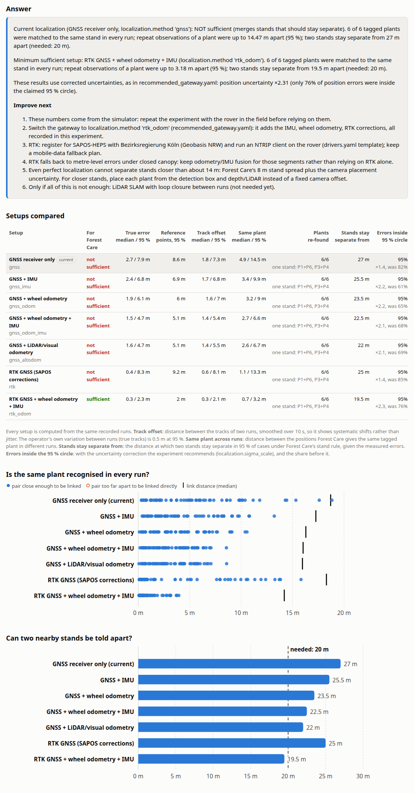

# Localization validation: can the rover find the same plant stand again?

Milestone 3 asks one practical question:

> Can the robot repeatedly place observations close enough to recognize the same plant
> stand across multiple survey runs?

The experiment drives the same short route several times, records all localization data
raw, and marks the same tagged plants and surveyed reference points in every run. One
command then compares seven localization setups on exactly the same data, and applies
Forest Care's own stand rule to the result.

Out of scope, on purpose: SLAM, autonomy, real-time localization on the rover. Localization
runs offline, after the drive, on the recorded bag.

## The answer so far (simulation)

The rover has not driven yet, so every number below comes from the gateway simulator. The
simulated result says:

| Question | Answer (simulated, 5 runs) |
|---|---|
| Is the same stand recognised in every run? | **Yes, with every setup.** All 6 tagged plants landed in one stand in each run, once the uncertainty is calibrated (below). |
| Is the current localization (GNSS receiver only) sufficient? | **No.** Repeat observations of one plant scatter up to 14.5 m (95 %). Two stands must be about 27 m apart to stay separate; the target is 20 m. It does re-find isolated stands. |
| Minimum sufficient stack | **RTK GNSS (SAPOS-HEPS) + wheel odometry + IMU**, fused offline (`rtk_odom`). Same plant within 3.2 m; stands separate from 19.5 m. |
| Is the reported uncertainty honest? | **No, for every setup.** Only 61–85 % of errors fell inside the claimed 95 % circle. The experiment measures a correction factor (`localization.sigma_scale`), and the dashboard then shows honest circles. |
| Hard limit | About **14 m**, even with perfect localization: Forest Care's 8 m stand spread plus the camera placement uncertainty. |

**What to improve next**, in this order:

1. **Run the experiment in the field** (one day, five runs; procedure below). The simulator's
   error models are plausible, not measured. The field result replaces this table.
2. **Fuse the sensors the rover already records** (`localization.method: gnss_odom_imu`).
   This is software only. In simulation it halves the scatter (14.5 → 6.6 m) and brings the
   separation to 22.5 m: close to the target, but not below it.
3. **Add RTK corrections**: register for SAPOS-HEPS and run an NTRIP client on the rover.
   The recommended receiver class (u-blox ZED-F9P) is RTK-capable already. RTK alone is not
   enough: under closed canopy it falls back to single-point fixes (errors up to ~10 m), so
   keep the odometry/IMU fusion (`rtk_odom`).
4. **Apply the calibrated uncertainty** from the field test (`recommended_gateway.yaml`).
5. Only if stands closer than ~15 m must be told apart: **place each plant from the
   detection box and depth/LiDAR** instead of a fixed camera offset. This lowers the 14 m
   limit.
6. **LiDAR odometry** helps where GNSS is worst, if a 3D LiDAR is on the rover anyway.
   **SLAM is not needed** for this question.



## Setups compared

All seven are computed from the same recorded runs. A setup whose sensor was not recorded is
reported as "not available".

| `localization.method` | Setup | How the trajectory is made |
|---|---|---|
| `gnss` | GNSS receiver only (the default today) | fixes interpolated in time; heading from the course over ground |
| `gnss_imu` | GNSS + IMU | EKF + smoother: yaw rate from the gyro |
| `gnss_odom` | GNSS + wheel odometry | EKF + smoother: speed and yaw rate from the wheels |
| `gnss_odom_imu` | GNSS + wheel odometry + IMU | EKF + smoother: speed from the wheels, yaw rate from the gyro |
| `gnss_altodom` | GNSS + LiDAR/visual odometry | EKF + smoother: speed and yaw rate from `/odom_lidar` |
| `rtk` | RTK GNSS only | as `gnss`, with the RTK receiver's fixes (`/gnss_rtk/fix`) |
| `rtk_odom` | RTK GNSS + wheel odometry + IMU | as `gnss_odom_imu`, with RTK fixes |

The estimator (`forestcare_gateway/loc/estimators.py`) is a textbook 2D extended Kalman
filter with a Rauch-Tung-Striebel smoother, in plain numpy:

- The state is position, heading, speed and a **GNSS bias**. Under trees most GNSS error is
  a slowly wandering offset, not independent noise. Modelling it stops the filter from
  claiming that averaging many fixes made the position precise.
- Multipath jumps are gated out (χ², 99.9 %). GNSS outages are bridged with odometry.
- The smoother uses the fixes before and after each moment, since missions are processed
  after the drive.
- **Tried and dropped:** estimating the odometry scale and gyro bias as extra states. With
  metre-level GNSS the filter cannot tell "slower" from "slightly off heading", and accuracy
  got worse; with RTK it gained nothing measurable.

## The experiment in the field

### Site and route

- **Route:** a closed loop of 150–300 m that the rover can drive at walking pace, for
  example a forest ride with a detour under closed canopy. At least a third of it should be
  under closed canopy and a third in the open, so both can be compared.
- **Permission:** as for any field drive (forest owner; nature reserve authority for NSG/FFH
  areas).

### Reference points

- 4–6 points along the route, each marked with a peg. **R1** is in the open, at the start.
- Survey them to about 0.3 m, which is well below the metre-level errors being measured:
  - in the open, with an RTK survey pole (SAPOS-HEPS);
  - under trees, where RTK is unreliable, with tape and compass from open-area points or a
    total station.
- Enter them in the experiment file. Without surveyed references, repeatability can still
  be measured, but the uncertainty cannot be calibrated.

### Tagged plants

- 6–10 plants with a numbered tag (P1, P2, …) on one stem. Any shrub works for the test;
  *P. serotina* is not required.
- Include **two pairs 10–25 m apart**: they show whether nearby stands stay separate.
  Include at least three plants under closed canopy.
- Optional: survey the plants too. Then the experiment also checks the observation circles
  (robot + camera placement) and corrects `camera.placement_sigma_m` if needed.

### Runs

- **At least five runs** of the same route, in the same direction, at ≤ 0.5 m/s.
- **Spread them over the day and over two days.** GPS satellite geometry repeats almost
  exactly one day later (about 4 minutes earlier). Runs at the same clock time on
  consecutive days therefore see similar GNSS errors and look more repeatable than real
  surveys, which are months apart.
- Test in the season you survey in: leaf-on canopy degrades GNSS more than leaf-off.

**Each run:**

1. Start `rover.launch.py` and `record_mission.sh --notes "loc test run 3, RTK on"`
   ([field setup](FIELD_DATA_COLLECTION.md)). All localization topics are recorded raw:
   GNSS (+ RTCM), IMU, wheel odometry, camera, LiDAR, `/tf`.
2. Park the rover with the antenna over R1 and wait 60 s. Mark `ref R1`.
3. Drive the loop. At each reference point, stop with the antenna over the peg and mark
   `ref R2`, `ref R3`, ….
4. At each tagged plant, stop so that the plant is in view, about `camera.forward_offset_m`
   (3 m) ahead of the antenna. Mark `plant P3 Prunus serotina?`.
   - Easiest with a second person typing into `ros2 run forestcare_gateway mark_console`.
   - With gamepad buttons only, mark the plants in a fixed order and list it as
     `plant_order` in the experiment file.
5. End on R1: mark `ref R1` again. This loop closure also measures odometry drift.
6. Ctrl-C.

### RTK with and without corrections

- **Two receivers (best):** a second GNSS receiver without corrections publishes
  `/gnss/fix`; the RTK receiver publishes `/gnss_rtk/fix`. All seven setups are compared on
  the same runs.
- **One receiver:** drive the runs twice, corrections off and on, and evaluate two
  experiment files. In the RTK file, map the receiver to both roles
  (`topics: {gnss: /gnss/fix, gnss_rtk: /gnss/fix}`) and set `methods: [rtk, rtk_odom]`.

### LiDAR/visual odometry

LiDAR odometry is computed offline from the recorded point clouds. Replay the bag, run a
LiDAR odometry node (for example KISS-ICP's ROS 2 launch file) with its odometry output
remapped to `/odom_lidar`, and record everything into a new bag:

```bash
ros2 bag record -a -o run3_lio/bag &              # original topics + /odom_lidar
ros2 bag play run3/bag --clock                    # plus the odometry node with use_sim_time:=true
```

Use the new bag in the experiment file. Odometry that publishes only poses (no twist) is
fine: the gateway derives speed and yaw rate from consecutive poses. This workflow is
**untested with real LiDAR data**.

## Analysis

1. Copy `ros2/forestcare_gateway/config/localization_experiment.yaml` next to the mission
   folders and fill it in: runs, gateway configuration, references, plants (optional), open
   areas (optional, drawn from the orthophoto), criteria, and `current_method` (what the
   rover runs today).
2. Run:

   ```bash
   python -m forestcare_gateway loc-eval experiment.yaml --out results/
   ```

3. It writes three files:
   - `report.html`: the answer, the comparison table and the charts. It opens offline and
     has a light and a dark theme.
   - `results.json`: every number in the report.
   - `recommended_gateway.yaml`: the localization method, `sigma_scale` and the validation
     note for the minimum sufficient setup.

**Applying the result.** Merge `recommended_gateway.yaml` into the rover's
`forestcare_gateway.yaml`. Every mission converted afterwards uses the method and the
calibrated uncertainty. Each observation also carries the validation note, which the
dashboard shows. Missions already uploaded keep their positions: uploads are idempotent by
observation ID, so a re-converted mission is not re-imported.

## What is measured

| Metric | Definition | Needs |
|---|---|---|
| Reference point error | Robot position at each `REF` mark vs. the surveyed point. Includes how exactly the operator parked (the simulated operator is off by up to ~0.4 m). | surveyed references |
| True error | Error along the whole trajectory. | simulation only |
| Track offset between runs | Each run's track smoothed over 10 s, then the distance to the nearest point of every other run's track. Shows systematic shifts between runs; smoothing stops a jittery track from looking "close" to everything. | – |
| Same plant across runs | Distance between the positions Forest Care gives the same tagged plant in two runs, for every pair. | tagged plants |
| Plants re-found | Tagged plants whose observations from all runs end up in **one stand** under Forest Care's rule: linked if closer than 8 m + 2·√(σ₁² + σ₂²). The experiment's copy of the rule forms exactly the backend's stands (tested). | tagged plants |
| Stands stay separate from | The measured placement errors are applied to two virtual stands *d* metres apart, for every pair of errors and in 8 directions. It is the smallest *d* at which at most 5 % would be linked into one stand. | tagged plants |
| Errors inside the 95 % circle | Share of position errors inside the circle the dashboard draws (2.45 σ). `sigma_scale` is the smallest factor that brings it to 95 %. The report shows both, before and after. | references or simulation |
| Observation circles | Share of surveyed plants inside their observation's 95 % circle (robot + placement). If too low, `camera.placement_sigma_m` is raised. | surveyed plants |
| GNSS quality under canopy | Per receiver and canopy class (open, partial = within 6 m of open, closed): valid fixes, fix status, reported σ, true error, true ÷ reported. | open-area polygons |
| Drift without GNSS | Odometry alone, per 100 m driven. In the field this is the **loop-closure** error: start and end on R1, where the dead-reckoned end should meet the start. It does not depend on the unknown start heading. | runs that end on R1 |

**Criteria** (in the experiment file; all three must hold):

| Criterion | Default | Status |
|---|---|---|
| Tagged plants re-found in one stand | ≥ 95 % | ASSUMPTION |
| Two stands this far apart stay separate | 20 m | **ASSUMPTION to agree with the ecologists who use the stands**: how close can two stands be that are managed separately? |
| Errors inside the 95 % circle, after correction | ≥ 90 % | keeps the dashboard's circles honest |

## In Forest Care

- Every robot observation shows its position and its **95 % uncertainty circle** on the map
  (2.45 × σ, with σ = √((robot σ × `sigma_scale`)² + placement σ²)).
- The "Robot capture" panel has a **Localization test** row: which experiment validated the
  setup, how many runs, when, whether it was simulated (yellow badge), the same-plant
  distance and the stand separation. Without a test it says "not checked yet: the circle is
  the robot's own estimate and can be too small under trees".
- Stand linking uses the same σ. A calibrated σ is what makes re-identification reliable: a
  too-small σ splits one plant into several stands.
- Reference marks are kept in the mission metadata; they are never observations.

## Simulated results in detail

`python -m forestcare_gateway loc-experiment --runs 5 --out /tmp/locexp` reproduces them in
about 45 s. The results are deterministic.

**The simulated site.** A 200 m loop (60 × 40 m) in simulated Bonn woodland: the southern
side in an open ride, the rest under closed canopy. It has four reference points at the
corners and six tagged plants. Two pairs are close together: P3/P4 are 12 m apart, and
P1/P6 are 13.6 m apart (P6 is the look-alike *Prunus padus*). Both pairs are below the
14 m limit, so every setup merges them.

| Setup | True error median / 95 % | Reference points 95 % | Track offset median / 95 % | Same plant median / 95 % | Plants re-found | Stands separate from | Uncertainty scale (coverage before) |
|---|---|---|---|---|---|---|---|
| GNSS only (current) | 2.7 / 7.9 m | 8.6 m | 1.8 / 7.3 m | 4.9 / 14.5 m | 6/6 | 27 m | ×1.4 (82 %) |
| GNSS + IMU | 2.4 / 6.8 m | 6.9 m | 1.7 / 6.8 m | 3.4 / 9.9 m | 6/6 | 25.5 m | ×2.2 (61 %) |
| GNSS + wheel odometry | 1.9 / 6.1 m | 6.1 m | 1.6 / 7.0 m | 3.2 / 9.0 m | 6/6 | 23.5 m | ×2.2 (65 %) |
| GNSS + wheel odometry + IMU | 1.5 / 4.7 m | 5.1 m | 1.4 / 5.4 m | 2.7 / 6.6 m | 6/6 | 22.5 m | ×2.1 (68 %) |
| GNSS + LiDAR odometry | 1.6 / 4.7 m | 5.1 m | 1.4 / 5.5 m | 2.6 / 6.7 m | 6/6 | 22 m | ×2.1 (69 %) |
| RTK only | 0.4 / 8.3 m | 9.3 m | 0.6 / 8.1 m | 1.1 / 13.3 m | 6/6 | 25 m | ×1.4 (85 %) |
| **RTK + wheel odometry + IMU** | **0.3 / 2.3 m** | **2.0 m** | **0.3 / 2.1 m** | **0.7 / 3.2 m** | **6/6** | **19.5 m** | ×2.3 (76 %) |

The operator's own variation between runs (true tracks) is 0.5 m at 95 %.

**GNSS under canopy (simulated):**

| Receiver, canopy | Valid fixes | Reported σ | True error median / 95 % | True ÷ reported |
|---|---|---|---|---|
| GNSS, open | 100 % | 1.3 m | 1.5 / 5.1 m | 1.3 |
| GNSS, closed | 98 % | 2.5 m | 4.4 / 8.8 m | 1.6 |
| RTK, open (fixed) | 100 % | 0.02 m | 0.02 / 0.04 m | 1.2 |
| RTK, edge (float) | 100 % | 0.26 m | 0.29 / 0.72 m | 1.1 |
| RTK, closed (single) | 95 % | 2.5 m | 4.3 / 9.9 m | 1.6 |

**Drift without GNSS (simulated):**

| Odometry | Loop closure, per 100 m | From the true start, per 100 m (median / 95 %) |
|---|---|---|
| Wheel odometry | 29 m | 14 / 36 m |
| LiDAR odometry | 2.5 m | 4.8 / 8.3 m |

**Simulator assumptions** (`forestcare_gateway/sim.py`; plausible, not measured):

- **GNSS:**
  - a slow bias (Gauss-Markov, τ = 90 s; σ from 0.8 m in the open to 4.3 m under closed
    canopy);
  - a fast wander (τ = 3 s, σ 0.3–1.5 m);
  - under canopy, multipath excursions about once a minute (σ 7 m, 3–8 s) and short outages;
  - the reported σ is up to 45 % too small under canopy.
- **RTK:** fixed in the open (1–2 cm), float at the canopy edge (~0.3 m), single-point fixes
  under closed canopy.
- **Wheel odometry:** 2 % scale error, yaw-rate bias and slip.
- **IMU:** gyro bias 0.1°/s with slow drift.
- **LiDAR odometry:** 0.3 % scale error; noisier in open areas, where there are few trunks
  to match.
- **Operator:** stops up to ±0.4 m from a reference and wanders 0.15–0.45 m sideways.

The simulation shows that the experiment and its analysis work, and what shape the answer
takes. Whether a setup lands just above or just below 20 m depends on these assumptions.
That is why the field test decides.

## What is hardware-independent, rover-specific, or needs field validation

| Hardware-independent (done, tested) | Rover-specific (to configure) | Needs field validation |
|---|---|---|
| Experiment file, `loc-eval`, metrics, report, recommended settings | Which sensors exist, hence which setups can be compared | GNSS error under real canopy: size, correlation time, under-reporting (the filter assumes τ = 120 s, 80 % of the variance is bias) |
| Seven setups computed from the same data; EKF + smoother | Topic remaps; one or two GNSS receivers | RTK fixed/float/single availability along the route |
| Stand rule identical to the backend (tested) | GNSS antenna position: the gateway treats the antenna as the robot position (mount it above `base_link`) | Wheel slip on leaves, mud and roots; gyro drift of the actual IMU |
| Uncertainty calibration (`sigma_scale`, placement σ) and its display in the dashboard | Camera offset and placement σ | LiDAR odometry in forest (and on open rides) |
| Loop-closure drift, single-receiver RTK mapping, pose-only odometry | NTRIP account, mount point, mobile data | The criteria, above all the 20 m separation |
| Simulated experiment (`loc-experiment`) | The route, references and tags per site | Leaf-on vs. leaf-off; how exactly the operator parks and marks |

## Field limitations

- **GNSS under canopy** is the dominant error, and no filter removes a slowly wandering
  bias: a biased fix looks exactly like a correct one. Only better GNSS (RTK, multi-band, a
  good antenna on a mast) or a map-based reference (SLAM against earlier runs) can.
- **Reference points under trees** are hard to survey; that is where the errors are
  largest. Plan the survey before the drive day.
- **A plant is not a point.** Tag one stem and mark from about the same spot each run, or
  the plant's own size shows up as localization error.
- **Few runs, few plants:** 5 runs × 6 plants give 60 pairs, so a 95 % value is rough
  (treat it as ±20 %). More plants help more than more runs.
- **2D only:** slopes and the antenna's height above the ground are ignored.
- **Heading** from GNSS course over ground is poor at walking speed. The fused setups use
  the gyro or wheels; the camera placement depends on it.

## Try it without hardware

```bash
uv run python -m forestcare_gateway loc-experiment --runs 5 --out /tmp/locexp
xdg-open /tmp/locexp/evaluation/report.html
```

It simulates five runs of the loop as real rosbag2 (MCAP) files, with RTK, LiDAR odometry
and tagged marks, writes `experiment.yaml`, and evaluates it like a field experiment. The
simulated bags carry `/sim/ground_truth`, so the report also shows the true error. Every
mission from them is labelled `simulated`.

## Tests

- `ros2/forestcare_gateway/test/test_localization.py`:
  - fusion bridges a GNSS outage;
  - a GNSS bias is not removed, and the claimed uncertainty says so;
  - `sigma_scale`;
  - track offsets see shifts, not jitter;
  - the stand-separation limit;
  - the stand rule;
  - pose-only odometry.
- `tests/test_localization_journey.py`:
  - simulated runs → experiment → report → recommended settings → gateway → Forest Care API;
  - the experiment's stands equal the backend's stands;
  - the dashboard shows the localization test (browser test).
