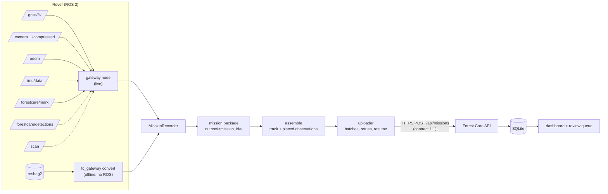

# ROS 2 gateway

The ROS 2 package `forestcare_gateway` (in `ros2/forestcare_gateway/`) turns rover data into
Forest Care missions. It records:

- the driven track;
- camera frames tied to the robot's pose and GNSS position;
- GNSS accuracy and sensor metadata;
- plant detections (when a perception node runs) and operator marks.

It uploads the result through the existing `POST /api/missions` API. When the server can't be
reached it keeps everything locally and retries later.

Design rules:

- **ROS stays on the robot side.** The Forest Care backend does not import ROS and does not
  know about topics. The gateway talks to it over HTTP only, like any other client.
- **The robot is a data source.** The gateway only listens and never commands the rover.
  Nothing it produces is a finding: every detection and every operator mark enters the
  Forest Care review queue, and people decide.
- **One code path for live and recorded data.** The live node and the offline bag converter
  feed the same `MissionRecorder`. A mission recorded live and the same mission converted
  later from its rosbag give identical observation IDs (tested), so uploading both creates no
  duplicates.
- **Plain Python below `nodes/`.** Only `forestcare_gateway/nodes/` imports `rclpy`. Bag
  conversion, upload and the simulator run on a laptop without ROS (they use the `rosbags`
  library to read and write real rosbag2 files).

## Quick start without hardware

From the repository root (`uv sync` installs the gateway's offline parts):

```bash
# 1. Forest Care
uv run python -m forestcare serve                         # http://127.0.0.1:8000

# 2. A simulated mission as a real rosbag2 (MCAP) file: 7.5 min drive, 5 operator marks, mock detections
uv run python -m forestcare_gateway demo-bag /tmp/fc/survey_bag
uv run python -m forestcare_gateway inspect  /tmp/fc/survey_bag          # sensor health check

# 3. Bag -> mission package -> Forest Care
uv run python -m forestcare_gateway convert /tmp/fc/survey_bag \
    --config ros2/forestcare_gateway/config/sim.yaml --outbox /tmp/fc/outbox
uv run python -m forestcare_gateway upload --outbox /tmp/fc/outbox --api http://127.0.0.1:8000
```

The mission appears in the dashboard under Missions. Its observations are in the review
queue, and each one shows its "Robot capture" details and a 95% position-uncertainty circle
on the map.

With ROS 2 (tested on Kilted; build once with `colcon build --symlink-install` in `ros2/`):

```bash
source /opt/ros/kilted/setup.bash && source ros2/install/setup.bash

# a) recorded data through the live node (use_sim_time + --clock: the node runs on bag time)
ros2 launch forestcare_gateway gateway.launch.py params:=my_gateway.yaml use_sim_time:=true
ros2 bag play /tmp/fc/survey_bag --clock
ros2 service call /forestcare_gateway/stop_mission std_srvs/srv/Trigger    # finish + upload

# b) a simulated rover that drives the demo route by itself; Ctrl-C finishes and uploads
ros2 launch forestcare_gateway sim_demo.launch.py api_url:=http://127.0.0.1:8000
```

`my_gateway.yaml` is a copy of `config/sim.yaml` with your `outbox_dir` and `api_url`. The
configuration is read once, at start-up.

## Expected ROS topics

All topic names are parameters (`topics.*`).

| Default topic | Type | Needed | Used for | Typical rate |
|---|---|---|---|---|
| `/gnss/fix` | `sensor_msgs/NavSatFix` | **yes** | position, accuracy (`position_covariance`), driven track | 1–10 Hz |
| `/camera/image_raw/compressed` | `sensor_msgs/CompressedImage` (JPEG/PNG) | **yes**, for images | the image of each observation | 2–15 Hz |
| same, without `/compressed` | `sensor_msgs/Image` (`rgb8`, `bgr8`, `mono8`) | alternative | converted to JPEG (needs Pillow) | |
| `/odom` | `nav_msgs/Odometry` | recommended | speed and odometry pose per observation; fusion methods | 20–50 Hz |
| `/imu/data` | `sensor_msgs/Imu` | recommended | roll/pitch per observation; fusion methods | 50–200 Hz |
| `/forestcare/mark` | `std_msgs/String` | for marks | observations flagged by the operator (see below) | events |
| `/forestcare/detections` | `vision_msgs/Detection2DArray` | optional | detections from a perception node | per frame |
| `/scan` | `sensor_msgs/LaserScan` (or `PointCloud2`, `lidar_type: points`) | optional | counted only; the raw scans stay in the rosbag | 10 Hz |
| `/gnss_rtk/fix` (`topics.gnss_rtk`) | `sensor_msgs/NavSatFix` | optional | second, RTK receiver ([localization](LOCALIZATION_VALIDATION.md)) | 1–10 Hz |
| `/odom_lidar` (`topics.odom_alt`) | `nav_msgs/Odometry` | optional | LiDAR/visual odometry ([localization](LOCALIZATION_VALIDATION.md)) | 10 Hz |

**Time stamps.** The gateway uses each message's `header.stamp`, which must be Unix time
(wall clock). Messages stamped before 2020 are counted, flagged and skipped: that means an
unset clock or sim time without `--clock`.

**Detections.** The gateway expects the `Detection2DArray` header stamp to equal the stamp of
the image it was computed on (the usual convention). `Detection2D.id` is treated as a
tracker ID.

**Marks.** A mark is a `std_msgs/String`: plain text is the label, and a JSON payload can
add `id`, `stamp_ns`, `note` and `source` (the mark node sends JSON).

- `REF:<id>` marks a surveyed reference point.
- `PLANT:<id> <label>` tags a known plant (localization experiment).

## Message flow



### Mission package

Each mission is a folder in the outbox (`outbox_dir`, default `~/forestcare_outbox`):

```
header.json        config snapshot, data source (live node / bag + its hash), operator info
gnss.jsonl         every GNSS fix                       (append-only while recording)
odom.jsonl, imu.jsonl, lidar.jsonl                       (decimated: 20 / 20 / 1 Hz)
frames.jsonl + frames/<stamp_ns>.jpg                     only frames an observation needs
detections.jsonl, marks.jsonl                            with the frame each one belongs to
stats.json         message counts, clock offsets, warnings
mission.json       the Forest Care mission, built when recording ends
upload.json        which observations the server already has
state.json         recording -> complete -> uploading -> uploaded | upload_failed | rejected | invalid
```

The logs are append-only, flushed after every line and fsync'ed every 5 s. If the process
dies, `fc_gateway recover <package>` rebuilds `mission.json` from what was written (tested
with a truncated last line). The package is derived data: when a rosbag was recorded as well,
the bag remains the complete raw record.

## Configuration

`config/gateway.yaml` (ROS parameter format; the offline tools read the same file) and
`config/sim.yaml` for the simulator. The most important settings:

| Setting | Default | Meaning |
|---|---|---|
| `robot_id` | `rover-01` | part of the mission ID |
| `source_kind` | `robot` | `simulated` for the sim rover and demo bags; Forest Care labels them |
| `survey_protocol` | `opportunistic` | `transect` only for systematic surveys; then the track may be used to infer "not re-detected" |
| `detection_range_m` | 8 | how far from the track the camera can see plants (transect coverage) |
| `camera.forward_offset_m` | 3 | distance from the antenna to the plants in view |
| `camera.yaw_offset_deg` | 0 | camera direction relative to driving direction (+ = left) |
| `camera.placement_sigma_m` | 2 | uncertainty of that projection |
| `camera.time_offset_s` | 0 | correction for late image stamps |
| `gnss.accuracy_scale` | 1 | multiplies the receiver's reported accuracy before localization (only for a receiver known to report wrongly) |
| `gnss.max_fix_gap_s` | 2 | an image further than this from a fix is not placed |
| `localization.method` | `gnss` | `gnss`, `gnss_imu`, `gnss_odom`, `gnss_odom_imu`, `gnss_altodom`, `rtk`, `rtk_odom` ([which one](LOCALIZATION_VALIDATION.md)) |
| `localization.sigma_scale` | 1 | multiplies the robot position uncertainty so that it is honest; measured by the [localization test](LOCALIZATION_VALIDATION.md) |
| `localization.validated` | `{}` | the test's result (written by `fc_gateway loc-eval`); travels with every observation and is shown in the dashboard |
| `detections.min_target_score` | 0.35 | detections below this are not sent |
| `detections.merge_radius_m` / `merge_window_s` | 4 / 30 | repeated detections of one plant become one observation |
| `outbox_dir`, `api_url`, `upload_on_finish`, `upload_batch_size` | | where packages go and how they are sent |

## How a mission is created

1. **Start.**
   - *Live node:* the node arms at start-up (`auto_start`) or via
     `~/start_mission` (`std_srvs/Trigger`). The mission starts with the first message that
     carries a valid time.
   - *Bag conversion:* the mission starts at the bag's first message.

   The mission ID is `<robot_id>-<UTC start time>`, e.g. `rover-01-20261002T081530Z`. It is
   the same for the live and the converted version of one drive.
2. **Record.** While driving, every message goes through `MissionRecorder.handle()` into the
   package.
3. **Finish.** Via `~/stop_mission`, Ctrl-C, or the end of the bag. The gateway then:
   - resolves pending marks and detections;
   - builds the trajectory (`localization.method`) and the track: thinned to 1 m, split at
     gaps > 10 s and jumps > 50 m;
   - places every observation and writes `mission.json`.
4. **Upload** (`upload_on_finish`, or later `fc_gateway upload`):
   - batches of 20 observations, each batch repeating the header and track;
   - progress saved after every batch;
   - network errors and 5xx answers are retried later;
   - a 4xx answer marks the package `rejected` for a person to check, instead of retrying
     forever.

   Observation IDs are stable (`<mission>-M<mark id>`, `<mission>-D<frame stamp>-<n>`), and
   the server ignores observations it already has.

A mission without any observation is still uploaded: its track shows where the rover drove.

## How images and metadata are associated

| Question | Rule |
|---|---|
| Which frame goes with a **detection**? | The frame whose stamp matches the detection's header stamp within `detections.frame_tolerance_s` (50 ms). The recorder keeps the last few seconds of frames in memory, so detections that arrive late (inference takes time) still find their frame. |
| Which frame goes with an **operator mark**? | The last frame at or before the button press (within 1 s), i.e. what the operator was looking at; otherwise the next frame. The metadata stores the offset (e.g. "frame shown 0.22 s before the press"). |
| Where was the robot at that time? | GNSS fixes before and after the frame's stamp are interpolated linearly; nothing is extrapolated over gaps longer than `max_fix_gap_s`. With a fusion method (`gnss_odom`, ...) the smoothed trajectory is used instead ([localization](LOCALIZATION_VALIDATION.md)). |
| Which way was it facing? | Course over ground from the positions 4 s before and after. The movement must exceed the position uncertainty. When the robot stands still (e.g. while marking), the heading from before it stopped is used. Fusion methods provide a filtered heading. |
| Where is the plant? | `camera.forward_offset_m` ahead of the antenna in the camera direction. |
| How uncertain is that? | `sqrt(robot_sigma² + placement_sigma²)`. Robot sigma is the reported GNSS sigma (or the fusion filter's sigma) × `localization.sigma_scale`. If the heading is unknown, the offset itself is added to the uncertainty. |
| Odometry, IMU | The nearest sample within 0.5 s (speed, odometry yaw, roll/pitch). |
| Repeated detections | Detections with the same tracker ID, or without ID but within 4 m and 30 s, become one observation. The best-scoring frame is kept, with the number of frames merged. |

Everything used is written to the observation's `metadata`:

- the frame (file, SHA-256, size, camera);
- localization (method, robot and observation sigma, GNSS status and reported sigma, whether
  interpolated, time to the nearest fix);
- the robot pose (heading and its source, odometry, IMU);
- the placement assumptions;
- the detection (box, all class scores, merged frames) or the mark (label, source, time).

The review UI shows these under "Robot capture". It checks that the image Forest Care stored
has the same SHA-256 as the frame recorded on the robot, and draws the detection box on the
image.

## Contract changes (API 1.1)

The existing contract was kept. The additions are optional and backwards compatible; all
earlier payloads and tests still pass. Each has a concrete reason:

| Addition | Why |
|---|---|
| `observation.metadata` (≤ 32 kB JSON) | Preserve GNSS accuracy, pose, time sync and frame integrity per observation, as the brief requires. Stored as sent, shown in the review UI. |
| `mission.metadata` (≤ 64 kB JSON) | Bag/source provenance, GNSS summary, clock offsets, localization method, reference marks. |
| Model fields may be empty (all three, or none) | Operator marks have no classifier output. Faking one would be dishonest. |
| `plant_count_est` may be `null` | An operator mark does not count plants; Forest Care treats it as presence-only. |
| `mission.model` optional | A mission without perception names no detector. |
| `mission.protocol` (`transect` \| `opportunistic`, default `transect`) | Operator-marked teleoperation surveys are presence-only: the track is shown, but absence is never inferred from it. |

## What works, what is mocked, what needs real hardware

| | Status |
|---|---|
| Bag → package → API → dashboard, with marks and detections | **Works**, tested end to end over real HTTP, plus a browser test of the dashboard |
| Live ROS 2 node on Kilted fed by `ros2 bag play --clock` | **Works**, tested (`uv run pytest -m ros`); same IDs as offline conversion |
| Live node with the simulated rover (`sim_demo.launch.py`) | **Works**, run manually (Ctrl-C finishes and uploads) |
| Offline outbox, resumable upload, retry, rejection handling, crash recovery, frame integrity | **Works**, unit-tested |
| Sensor data, camera frames, detections, operator | **Mocked**: `sim.py` (drawn frames, statistical error models, scripted operator). Clearly labelled `simulated` end to end. |
| `vision_msgs` detections through a *live* node | Code path shared with the tested bag path; not run live here, because the Kilted install on this machine has no `vision_msgs` |
| A physical rover | **Not yet connected.** Drivers, topic names, mounting offsets, clock sync and camera latency must be set per rover ([field setup](FIELD_DATA_COLLECTION.md)) |

## Assumptions that still need field validation

1. **Camera placement.** `forward_offset_m`, `yaw_offset_deg` and `placement_sigma_m`
   describe the camera setup only roughly. Measure where plants actually appear relative to
   the antenna for the real camera mount, or replace the projection with calibrated
   intrinsics plus depth.
2. **Detection range.** `detection_range_m` = 8 m is only relevant for `transect`
   missions; measure it in real undergrowth.
3. **GNSS accuracy under canopy.** Receivers report their error too optimistically under
   canopy (the simulator assumes up to 45% too small). `localization.sigma_scale` comes from
   the [localization test](LOCALIZATION_VALIDATION.md).
4. **Clocks.** Image stamps must be close to the GNSS/system clock. Check the camera
   driver's stamping (capture time or publish time?) and set `camera.time_offset_s`.
   `fc_gateway inspect` and `preflight` report header-vs-arrival offsets per topic.
5. **Marking delay.** When the operator presses "mark", the right frame is assumed to be the
   last one shown. With a laggy video link, the window may need to reach further back.
6. **Detection classes.** A real detector's labels must map onto the four classes in
   `detections.class_map`, and its scores must be comparable to the 0.35 threshold (softmax
   probabilities vs. independent detector confidences).
7. **Upload link.** Upload size is about 1.4 × the JPEG size per observation. On a weak
   field connection, keep `upload_on_finish` on and let `fc_gateway upload --retry-for` run
   later from the office.
